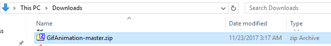
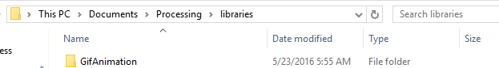

# Use Processing to make an animated GIF
### Step 1: Download and install the `gifAnimation` processing library
Go to [https://github.com/01010101/GifAnimation](https://github.com/01010101/GifAnimation) and download [GifAnimation.zip](https://github.com/01010101/GifAnimation/archive/master.zip). You should now have a folder called `GifAnimation-master.zip` in your downloads folder. It should look similar to this:   

Extract the folder, rename it as `GifAnimation` and copy it to your Processing library folder. On my Windows PC, the path to my libraries folder is `C:\Users\Art\Documents\Processing\libraries`. Here's a screenshot of the my `GifAnimation` folder in the libraries folder:   

